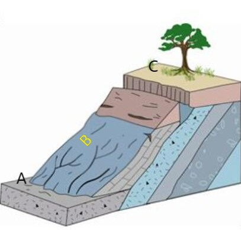

[TOC]

# 队式20

<!--本内容以简化、易上手为原则，作为一个不画饼的安全设计-->

## 一、总述

整个地图基于模仿吃鸡的模式，故事背景暂定，一些细节名字有待修正，本文档现(2018/8/6)谨作面向选手风格的规定。每支参赛队伍由至多四人组成，最终全队提交至多四个不同的AI（如不足则用样例AI来补）。所有参赛队伍的AI将控制相应角色同时被随机投放到地图各处，在地图上获取装备、补给等，经过战斗直到只剩下一支队伍的角色存活时游戏结束。本文中将以玩家指代参赛选手，以AI指代参赛选手所写程序，以角色指代AI所控制的在游戏中进行战斗的对象。

本游戏基于平面直角坐标系标的表示法，角色模型统一为一个半径为<!--待定-->的圆，地图大小为$m*n$（待定），玩家只需要根据的视野处理范围内的信息。游戏将以帧作为回合界限（即调用玩家AI的频率），并以<!--每秒20帧（20fps）-->的速度进行。

## 二、规则

### (1)指令

玩家的指令接口包括**移动**、**攻击**、**拾取**、**无线电**。某些情况下一个指令可能需要不止一帧的时间（**CD**）来完成，需注意角色在某指令导致的CD期间不可接受相同指令（如正在开枪时无法接受攻击指令），AI需要分析局面，合理发送指令来博取优势、取得胜利。发送一次指令时，需要指明指令名、给定该指令的相关参数，无效的参数和指令也将被无视，且<u>同一回合相同指令只能发送一条。</u>具体指令解释如下：

#### a.移动

- [ ] ##### 简介

移动是一个无CD的指令，移动方向将由移动角度指令决定，移动速度（每次移动指令移动距离）一般固定为<!--10-->，影响移动速度的要素见后，移动时遇到障碍物（地形、角色、道具）自动停止，视野朝向由面向角度指定，下一帧角色将完成移动并将**视线**将调整到该方向。

- [ ] #####指令参数

1. 移动角度：一个`float`量，应当不小于**-180**且不超过**180**<!--采用 角度/弧度制，以 视线/x轴正向 为基准可以后期再做商讨-->。
2. 面向角度：一个`float`量，应当不小于**-180**且不超过**180**。

#### b.攻击

- [x] ##### 简介

发送攻击指令后将使用指定武器朝指定方位进行攻击，攻击应当指明用来攻击的武器ID，攻击角度，以及可能有的特殊参数。攻击指令一定会有CD，由武器决定，不合法的攻击指令同样被无视。

- [x] ##### 指令参数

1. 攻击角度：一个`float`量，取值范围为视角范围（即攻击视角之外区域必须先使用调整指令转身），计算方法是相对视角逆时针的角度。
2. 武器ID：一个`unsigned int`量，指明自己用来攻击的武器的ID。
3. 特殊参数：一个`int`（宏）量，只对部分特殊武器生效，将在武器部分给出。

#### c.拾取

- [x] ##### 简介

当角色**感知**内有可拾取的物品时，可以通过发送拾取指令来捡起目标物品，需要指定物品ID，拾取本身无CD，但是某些特殊即捡即用物品可能会产生使用CD（详见[物品](#(3)物品) 部分）。对于某些特殊物品可能需要用到附加参数。不合法的拾取指令将被无视，同一回合内不同角色拾取同一物品将随机决定一个人拾取成功。

- [x] ##### 指令参数

1. 物品ID：一个`unsigned int`量，指明操作对象的物品ID，如果指定ID为自己物品将会原地丢弃该物品。
2. 附加参数：一个`int`量，某些特殊物品需要用到。

####d.无线电

- [x] ##### 简介

无线电指令是本游戏团队合作的精髓，借助我们封装好的接口，玩家可以给队友发送一些如“按兵不动”、“撤退”等无线电消息，并且接收者可以获取发送者ID、坐标、血量等信息，这些消息将被封装在消息结构体里。（如果玩家不满足于给出的无线电，亦可用一个32位整数在自行编码）

- [ ] ##### 指令参数

1. 目标ID：一个`unsigned int`量，表示目标的ID。另外通信兵有额外参数，在通信兵处给出。
2. 消息：一个`unsigned char/int`量，作为发送的消息传出，给出的消息可在[选手接口](#三、选手接口) 查询。

### (2)感知

#### a.视觉

视觉是获取游戏信息的主要途径，每名角色始终有三个关于重要视觉的重要变量:**视线**、**视角**和**视距**。角色的视野为一个扇形区域，视线即扇形的中心线，扇形区域将沿中心线顺逆时针各转视角的半角，我们将视觉可以获取信息的地方称作**视野范围**，具体来说可以参考下图（俯视图）:

图中的direction所给定的红线就是视线，β=180°就是视角（仅举例，实际参数未必是这么多），红色线段的长度，也即扇形半径，既是视距，而图中的粉色区域与绿色区域的并集就是视野范围。需要注意的是游戏给出的信息仅仅是视野范围内可获取的信息，但是可能会遇到障碍物，比如上图中我们假设x正半轴上有一堵高墙，那么绿色范围的信息AI不可获取，此时AI只能获取到x正半轴上有一堵墙。

在实际游戏中通常只有视线是AI可以自行决定的，视角和视距都由角色的**职业**、**物品**、所处**地形**等决定，AI只能获取这些参数而不能改变，角色一帧里所有视觉获取的元素保存在一个列表中（平地地形即为无元素，不会列入），该列表每个元素包含信息如下：

- ID：一个`unsigned int`型变量，包括角色/地形/物品都有统一化的ID。
- 类型：一个枚举值，给出具体的元素类型（角色、具体地形类型、具体物品类型）
- 详情：一个结构体，不同类型元素包含不同信息，具体内容参见（[角色信息](#(5)角色信息) /[地形](#(4)地形) /[物品](#(3)物品)）

#### b.听觉

视觉作为主要信息获取途径，通常是AI主动获取，而听觉则是一个被动获取信息的过程。游戏中的听觉信息主要分为两大来源：**环境声音**与**无线电**。获取到的听觉信息会放到一个队列里，如果没有及时获取，则会在下一帧里自动清空。玩家可以通过相关接口获取声音消息来源、内容以及其他信息，AI理应每回合将该队列遍历一遍并做出判断。所有的声音信息均包括**消息**、**发送者**和**时延**，其中消息是一个32位整数承载消息所含的信息，玩家可以通过给定接口解析消息得到一个结构体，发送者是一个`unsigned int`作为信源ID，时延是一个<!--times-->型变量告诉接收者这则消息距离发送过去了多少帧。听觉相关特征如下：

1. 环境声音：信源ID为-1（即0xffffffff），消息中包含声音类型与方向。
2. 无线电：见[无线电](#d.无线电) 部分

附表：不同类型声音的发出时机与宏

| 声音类型 | 发出时机       | 传播距离                  | 宏<!--待定--> |
| -------- | :------------- | ------------------------- | ------------- |
| 脚步声   | 移动速度时发出 | <!--300-->                |               |
| 枪声     | 子弹出膛时发出 | [物品](#(3)物品) 部分给出 |               |

### (3)物品

物品是对游戏中各类可获取、可使用物的一个统称，可分为**装备**、**道具**。其中，不同的物品属性决定了一个物品的基本特征，而同类物品又有各自独特的属性，这里将详细列出。

#### a.整体特征

- 装备：角色可以重复使用的物品，装备均有一个值（**耐久度**）来衡量其使用程度，当耐久度为0时装备将永久消失。装备又可以分为防具和武器，具体说来防具的耐久度即为防具的磨损度，遭受攻击时视情况损失耐久度，武器的耐久度则是指子弹数（特别的，近战武器也有类似的概念）。<u>同类装备只能携带一件,拾取装备后将自动丢弃同类装备</u>，且装备是不会作为障碍物阻拦角色移动的。
- 道具：一次性使用的物品，具体种类较多，拾取规则视具体物体而定，道具将有一定半径阻拦角色移动。

#### b.所有物品

<!--将手雷等原计划列入道具的物品也算为武器，以便攻击接口归一化，另外将药品、电子设备、四维传送门等均列为道具。-->

####  装备类

####  a.通用步枪
装备-主武器
耐久度 30
攻击距离 360
攻击CD 2
伤害系数 45

####  b.通用手枪
装备-副武器
耐久度 15
攻击距离 35
攻击CD 3
伤害系数 35

####  c.通用机枪
装备-主武器
耐久度 100
攻击距离 300
攻击CD 2
伤害系数 40
特性 攻击时降低50%移动速度

####  d.通用冲锋枪
装备-主武器
耐久度 30
攻击距离 200
攻击CD 1
伤害系数 25

####  e.通用狙击枪
装备-主武器
耐久度 15
攻击距离 550
攻击CD 20
伤害系数 80

####  f.连射狙击枪
装备-主武器
耐久度 30
攻击距离 550
攻击CD 5
伤害系数 50

####  g.通用霰弹枪
装备-主武器
耐久度 10
攻击距离 30
攻击CD 8
伤害系数 200
特性 伤害随与攻击目标间距离递减

####  h.通用迫击炮
装备-主武器
耐久度 5
攻击距离 600
攻击CD 40
伤害系数 220
特性 伤害随投掷点与目标间距离递减，发出攻击指令等待CD完成后攻击才会生效，期间发出其他指令会打断攻击
特殊参数 给定投掷点与玩家间距离，无法被地形阻挡

####  i.通用手榴弹
装备-投掷武器
耐久度 1
攻击距离 50
攻击CD 0
伤害系数 120
特性 伤害随投掷点与目标间距离递减
特殊参数 给定投掷点与玩家间距离，可被地形阻挡

#### 道具类
部分稀有道具可设定为仅可从密码箱中得到

####  a.扩容弹夹
特性 拾取后增加所有武器50%耐久度

####  b.消音器 
特性 拾取后降低枪声传播范围

####  c.一次性密码破译器
特性 可以让非黑客角色开启密码箱，使用后消失

####  d.绷带
使用CD 40
特性 回复30点生命值，发出使用指令等待CD完成后道具才会生效，期间发出其他指令会打断

####  e.医疗包
使用CD 60
特性 回复60点生命值，发出使用指令等待CD完成后道具才会生效，期间发出其他指令会打断

####  f.医疗箱（稀有）
使用CD 80
特性 回复100点生命值，发出使用指令等待CD完成后道具才会生效，期间发出其他指令会打断

####  g.无人机
特性 为你提供距离300内视野，使用期间发出其他指令会打断

####  h.作战车（稀有）
特性 属性等同于一个装备2级甲的角色，装备通用机枪，使用后可改为控制该作战车行动
PS：可能需要一个单独命令来退出控制模式

####  i.炮台
特性 属性等同于一个装备2级甲的角色，装备通用机枪，无法移动，自动攻击距离300内敌人，玩家无法获取炮台视野
PS：是否需要设置持续时间

####  j.防弹衣
耐久度 100
特性 分为1，2，3级甲，分别减少受到伤害的30%/40%/55%，受到攻击时会减少受到伤害80%的耐久度

####  k.倍镜
特性 分为2，4，8倍镜，使用后会减少两侧共30/60/90度视角，增加100/250/400视距，并提高50/100/150武器射程，使用霰弹枪、迫击炮、手榴弹不会提供额外射程

####  l.信号干扰器 
特性 属性等同于一个装备1级甲的角色，无法移动，无法攻击，其距离600内敌方队伍无法接收无线电，带有通信兵的队伍不受干扰，可回收
PS：为了迎合下通信兵避开干扰的特点设置的，可以无视。。。

####  m.密码箱
简介：我得不到的别人也不可能得到，虽然你打不开它，但可以带走它
特性 随机出现在地图各处，打开后可获得强力武器和道具，仅黑客和携带有一次性密码破译器的角色可以打开它

### (4)地形

地形是指非平地部分的地形，没有任何特性的平地不被考虑为地形（但仍然占有一个位置，作为一些情况下的缺省值）。地形有两种形状，圆形与四边形：圆形地形玩家获取信息可以得到其圆心坐标与半径，以下简称圆；四边形区域玩家可以得到其四个顶点坐标，以下简称方。<u>所有地形均不可被破坏</u>。

#### a.平地

- 描述：即无地形
- 形状：无
- 特性：无

#### b.树木

- 描述：路边常见的树木，大小不一，常被用作掩体。也不知道这些树是什么做的，大炮都炸不烂……
- 形状：圆
- 特性：可遮挡视野，阻拦子弹（注：某些情况下不可阻拦，详见[物品](#b.所有物品) 部分），不可通行。

#### c.矮墙

- 描述：高度惊人统一的矮墙，明明看上去是石头，偏偏像钛合金一样坚硬，明明看着不怎么高，偏偏就是翻不过去。
- 形状：方
- 特性：子弹有50%概率被遮挡，炮弹无法穿过，不可通行。

#### d.草丛

- 描述：比矮墙还高的草丛，拿来混淆视听绝对方便。
- 形状：圆
- 特性：<u>角色圆心在草丛中时视为角色在草丛中</u>，角色到草丛距离（计算到草丛边界最近距离）大于<!--20-->时无法看到该草丛中角色。

#### e.浅滩

- 描述：常在河边走，哪能不湿鞋？早晚都要湿，干脆走进去。
- 形状：方
- 特性：角色圆心在浅滩中时视为在浅滩中，在浅滩移动速度下降30%，有20%概率不被子弹击中。

#### f.深水

- 描述：大海无量……哎呀又呛水了！
- 形状：方
- 特性：角色圆心在深水中时视为在深水中，角色在深水中移动速度下降50%，有50%概率不被子弹击中，每回合损失<!--?-->HP。

#### g.峭壁

- 描述：看着不高不矮的峭壁，跳下去应该能活命吧？
- 形状：方
- 特性：峭壁四条边分为低侧、高侧、同侧，子弹、角色均无法从峭壁低侧射往高侧，地处角色的视距蔓延到高侧时会被强行缩减为<!--20-->，高侧角色移动往低侧时会损失<!--30-->HP。

#### h.斜坡

- 描述：谁说上山容易下山难？我看顺着斜坡滚下去挺便捷的~
- 形状：方
- 特性：斜坡四条边分为低侧、高侧、同侧，角色从高侧向低侧移动时速度上升30%，反之下降30%，视野范围与一般子弹经斜坡往上只能蔓延到斜坡区域（解释见下图）。

  

（图示中AB都将不可能看见或用直线式子弹击中C，无论视距与攻击距离是否充足）

#### i.待补

#### j.待补

#### k.待补

### (5)角色信息

角色信息指的AI可以获取的关于自己所操控角色的全部内在信息，包括：**HP**、**视线**、**视距**、**视角**、**坐标**、**装备**。以下给出这些信息的概念，可见/不可见指其他人能否通过视觉感知到这些信息，需要注意的是可见性对敌人和队友没有差异，需要向队友透露特别信息可用无线电来完成。

- HP：Heal Point，血量，该值一个0到100之间的整数，受到伤害后会降低，降至0时角色死亡。除0外不可见。
- 视线/视距/视角：见[感知](#(2)感知) 。视线可见，视距与视角不可见。
- 坐标：即角色圆心坐标。可见。
- 装备：见[物品](#(3)物品) 。可见。

### (*6*)职业

每一个AI在游戏开始前都应该选择一个职业决定自己角色的特殊属性，职业一旦选择不可更改，且同一支队伍AI不得选择重复的职业，玩家应当合理选择职业以组成强大的队伍。所有职业描述与特性如下：

#### a.医疗兵

简介：人在江湖走，哪能不挨刀？挨刀不要紧，我有医疗兵！医疗兵理应是团队不可缺少的一部分，能够携带药品，救治队友，甚至让HP降为0的队友获得新生。

特性：可以将药品作为道具携带；可以对队友使用药品（效果降至80%）；可以对HP为0的队友使用药品以复活角色（效果降至50%，且每个角色最多被复活一次）。

定位：奶妈

语录：“我还能再救一个！”

#### b.工程师

简介：都9012年了，无人机都不会玩？哼，且看我控制那边的侦察机和作战车剿灭前面那支队伍。工程师是昔日~~电设拿过冠军的存在，~~接受过良好的硬件训练，精通各种电子设备的使用，只有工程师才能修复并操控地图上的大型电子设备等。

特性：可以修复并控制随机投放的侦察机、作战车、炮台。

定位：辅助/坦克（操控对象）

语录：“你的操作方式是对这些美丽的金属生命的残忍践踏！”

#### c.通信兵

简介：说好的团队作战，怎么又玩成个人英雄主义了？苟利队伍生死以，无论祸福我指挥！通信兵能够使用<!--求补一个合适频率，我不知道该写啥-->波段的高频信号进行通信，避开干扰，从而更高效地传播信号，增强队友发送无线电的能力。

特性：可以群发无线电；队伍里有通信兵时所有队员发送无线电的传播速度将翻倍。

定位：统领

语录：“嘀……嘀嘀嘀……嘀……嘀嘀嘀嘀……”

#### d.黑客

简介：那一天，我选择了该死的红色药丸，从此漫步在命运与虚实的谎言中……黑客拥有极高的软件能力，精通C++以外所有编程语言，能够使用四维传送门，解锁密码箱以获取高级装备。

特性：可以打开/关闭地图中的四维传送门；可以破解随机投放的密码箱并暴露出其中的装备。

定位：辅助

语录：“我深刻地怀疑我们所处的世界是二维的，到底是谁蒙蔽了我们的双眼？”

#### e.狙击手

简介：屏息，凝神，静候——一击必杀！狙击手精通狙击之道，善于用狙击枪进行弱点攻击，能够最大程度地发挥出狙击的作用。

特性：使用狙击枪时伤害翻倍。

定位：输出

语录：“形神合一，攻敌一处。”

### (7)逻辑顺序

1. ​
2. ​

### (8)赛制

## 三、选手接口
